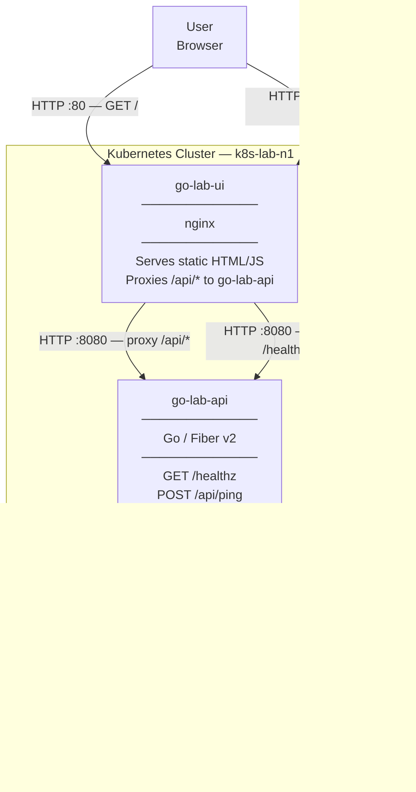

# C4 Level 2 — Containers

Shows the three runtime components inside the platform and how they communicate.

```mermaid
flowchart TD
    user["User\nBrowser"]

    subgraph k8s["Kubernetes Cluster — k8s-lab-n1"]
        ui["go-lab-ui\n─────────────\nnginx\n─────────────\nServes static HTML/JS\nProxies /api/* to go-lab-api"]
        api["go-lab-api\n─────────────\nGo / Fiber v2\n─────────────\nGET /healthz\nPOST /api/ping"]
        db[("go-lab-db\n─────────────\nPostgreSQL 16\n─────────────\nbutton_stats table\nclick counter")]
    end

    user -->|"HTTP :80 — GET /"| ui
    user -->|"HTTP :80 — POST /api/ping"| ui
    ui -->|"HTTP :8080 — proxy /api/*"| api
    ui -->|"HTTP :8080 — proxy /healthz"| api
    api -->|"TCP :5432 — SELECT / UPDATE"| db
```
