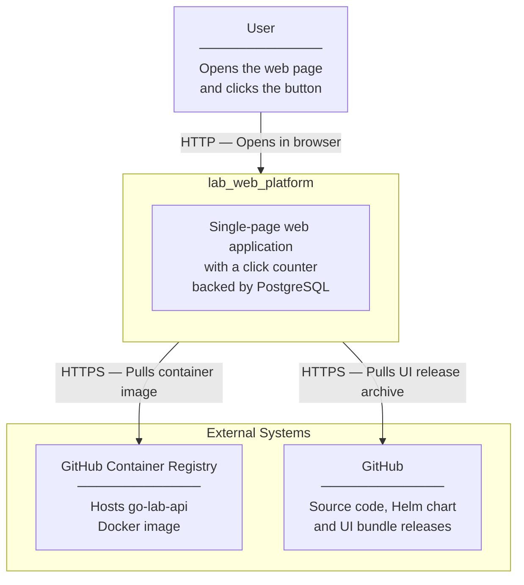

# C4 Level 1 — System Context

Shows how the platform fits into its environment and who interacts with it.

```mermaid
flowchart TD
    user["User\n─────────────\nOpens the web page\nand clicks the button"]

    subgraph platform["lab_web_platform"]
        direction TB
        app["Single-page web application\nwith a click counter\nbacked by PostgreSQL"]
    end

    subgraph external["External Systems"]
        ghcr["GitHub Container Registry\n─────────────\nHosts go-lab-api\nDocker image"]
        github["GitHub\n─────────────\nSource code, Helm chart\nand UI bundle releases"]
    end

    user -->|"HTTP — Opens in browser"| platform
    platform -->|"HTTPS — Pulls container image"| ghcr
    platform -->|"HTTPS — Pulls UI release archive"| github
```
